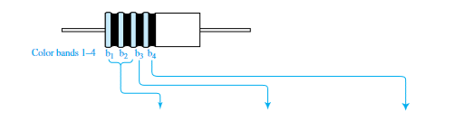

# Color-Coded Band

## TABLE 1.2.2 Standard Color-Coded Bands for Evaluating Resistance and Their Interpretation

| Color of Band     | Digit of Band |   Multiplier    | % Tolerance in Actual Value |
|-------------------|:-------------:|:---------------:|:---------------------------:|
| Black             |       0       | 100  |              —              |
| Brown             |       1       | 101  |              —              |
| Red               |       2       | 102  |              —              |
| Orange            |       3       | 103  |              —              |
| Yellow            |       4       | 104  |              —              |
| Green             |       5       | 105  |              —              |
| Blue              |       6       | 106  |              —              |
| Violet            |       7       | 107  |              —              |
| Grey              |       8       | 108  |              —              |
| White             |       9       |        —        |              —              |
| Gold              |       —       | 10−1 |            ± 5%             |
| Silver            |       —       | 10−2 |            ± 10%            |
| Black or no color |       —       |        —        |            ± 20%            |
