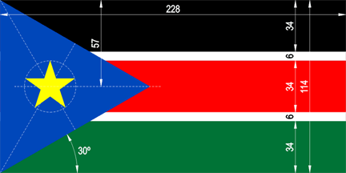
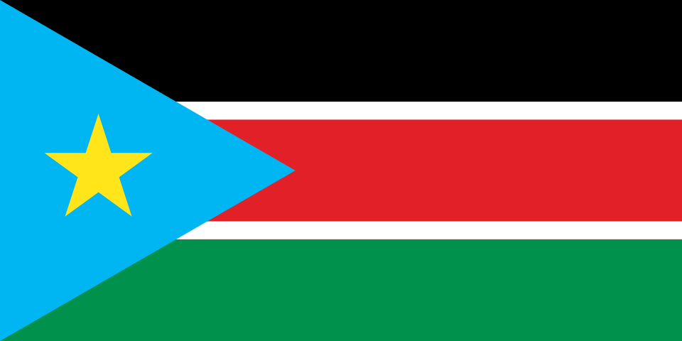

# South Sudan Flag

## Table of contents

- [South Sudan Flag](#south-sudan-flag)
  - [Table of contents](#table-of-contents)
  - [Background](#background)
  - [colors](#colors)
  - [What is the meaning of colors in the South Sudan flag?](#what-is-the-meaning-of-colors-in-the-south-sudan-flag)
    - [Flag color code](#flag-color-code)
    - [Wikipedia](#wikipedia)
    - [The Album des Pavillons 2023](#the-album-des-pavillons-2023)
  - [Dimensions](#dimensions)

## Background

Following the signing of a peace accord between the government of Sudan and the rebel forces of the South in Nairobi 09 January 2005. There is a report from The Nation (Nairobi, Kenya) saying that under the accord, the South will not only enjoy political autonomy and the prospect of an independence referendum, but that the South is also entitled to fly a distinct flag. The flag is described as follows:

"The south will have a new flag that closely resembles Kenya's in its features and colours. A black stripe at the top represents the identity of the eight million people. There is a star against a blue background representing the River Nile. It signifies a future with optimism for the people of southern Sudan. Red stands for the blood shed by the southern Sudanese in the 21 years of armed conflict while green stands for the region's agricultural potential."
Source: <http://allafrica.com/stories/200501100007.html>

## colors

## What is the meaning of colors in the South Sudan flag?

Blue, yellow, black, white, red and green, the six colors in the South Sudanese flag, stand for the river nile, the people's unity in defending national freedom, black african people, peace, martyrs of war and fertile soil and rich equatorial vegetation, respectively. Also, specially in case of state flags, the meaning associated with the colors are generally endorsed by an official charter. However, at times the symbolism is simply understood by being descended from the culture of the land or has seeped so deeply into customs that, now, the two are inextricably linked. Please also note that there can be more than one meaning for the colors in the South Sudan flag.

### Flag color code

| color   | blue      | yellow    | black     | white       | red        | green      |
| ------- | --------- | --------- | --------- | ----------- | ---------- | ---------- |
| Hex     | 0F47FF    | FCDD09    | 000000    | FFFFFF      | DA121A     | 078930     |
| RGB     | 15,71,255 | 252,221,9 | 0,0,0     | 255,255,255 | 218-18-26  | 7,137,48   |
| CMYK    | 94,72,0,0 | 0,12,96,1 | 0,0,0,100 | 0,0,0,0     | 0-92-88-15 | 95,0,65,46 |
| Pantone | 285 C     | Yellow C  | Black 6 C | N. A.       | 2035 C     | 348 C      |
| RAL     | 5015      | 1026      | 9005      | N. A.       | 3028       | 6037       |

### Wikipedia

| name     | CMYK        | HEX     | RGB         |
| -------- | ----------- | ------- | ----------- |
| Sky Blue | 100-25-0-5  | #00B6F2 | 0-182-242   |
| Yellow   | 0-10-90-0   | #FFE51A | 255-229-26  |
| Black    | 0-0-0-100   | #000000 | 0-0-0       |
| Red      | 0-86-82-11  | #E22028 | 226-32-40   |
| Green    | 100-0-48-43 | #00914C | 0-145-76    |
| White    | 0-0-0-0     | #FFFFFF | 255-255-255 |

### The Album des Pavillons 2023

| Name   | Pantone | CMYK         | RGB       |
| ------ | ------- | ------------ | --------- |
| Blue   | 286c    | 99-80-0-0    | 0-53-173  |
| Red    | 186c    | 10-100-74-2  | 210-16-52 |
| Yellow | 109c    | 0-17-93-0    | 255-209-0 |
| Green  | 356c    | 89-29-100-18 | 0-114-41  |

## Dimensions

- Aspect ratio: 1 : 2

source: [CRW Flags](https://www.crwflags.com/fotw/flags/ss.html)
